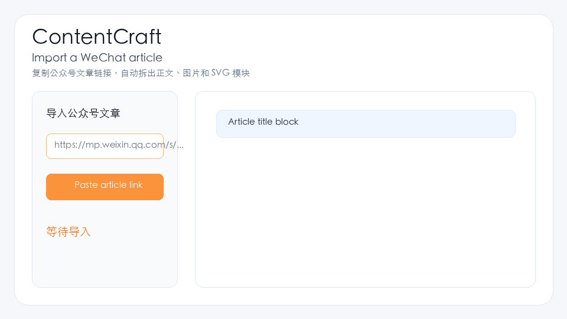
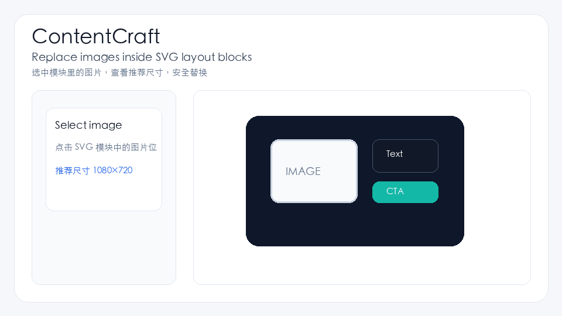
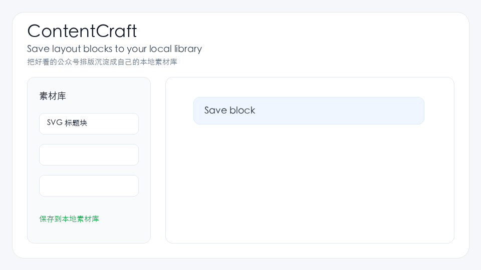

# ContentCraft — Reuse WeChat SVG Layouts

<p align="center">
  
</p>

<p align="center">
  <strong>复制一篇公众号文章，提取 SVG 排版模块，替换图片，沉淀自己的本地素材库。</strong>
</p>

<p align="center">
  多数公众号编辑器解决“写文章”，ContentCraft 解决“复用好看的排版”。
</p>

<p align="center">
  <a href="https://github.com/luobuchao0321/wechat-article-editor/stargazers"></a>
  <a href="https://github.com/luobuchao0321/wechat-article-editor/blob/main/LICENSE"></a>
  <a href="https://github.com/luobuchao0321/wechat-article-editor/releases/tag/v1.0.1"></a>
  <a href="https://github.com/luobuchao0321/wechat-article-editor"></a>
</p>

<p align="center">
  <a href="https://github.com/luobuchao0321/wechat-article-editor/releases/tag/v1.0.1">Download Desktop App</a> ·
  <a href="#为什么是-contentcraft">为什么是 ContentCraft</a> ·
  <a href="#功能演示">功能演示</a> ·
  <a href="#快速开始">快速开始</a> ·
  <a href="./README.en.md">English</a>
</p>

---


## 为什么是 ContentCraft

ContentCraft 不是 Markdown 编辑器，而是公众号 SVG 排版模块复用工具。

它面向内容创作者、运营团队和二次开发者，帮助你把已经存在的公众号排版拆成可复用资产：

- 导入公众号文章，提取正文、图片、SVG 和排版模块
- 选中 SVG/HTML 模块，替换图片、改字、调背景和间距
- 把标题块、尾图、分隔符、动图等保存到本地素材库
- 在新文章里复用模块，并一键复制为公众号兼容的内联 HTML

> 不是“从 Markdown 写一篇文章”，而是“把好看的公众号排版拆成可复用素材库”。

## 功能演示

| Import | Replace | Reuse |
| --- | --- | --- |
|  |  |  |

## 立即体验

- 桌面安装包：[ContentCraft v1.0.1 Release](https://github.com/luobuchao0321/wechat-article-editor/releases/tag/v1.0.1)
- 本地开发：见下方 [快速开始](#快速开始)
- 在线 Demo：准备部署中，当前可使用 Vercel 一键部署到自己的账号

[](https://vercel.com/new/clone?repository-url=https://github.com/luobuchao0321/wechat-article-editor)

## 功能亮点

- **公众号文章导入**：解析文章内容，提取正文、图片、SVG、排版模块
- **SVG 模块复用**：把标题、尾图、分隔符、图文卡片保存为本地素材
- **图片安全替换**：识别模块中图片位置，替换前提示推荐尺寸
- **模块化编辑**：插入的 SVG/排版模块可独立移动、复制、留白和删除
- **智能小助手**：接入自有模型接口，做标题、摘要、润色、去 AI 味和风险检查
- **一键复制**：导出兼容微信公众号编辑器、135 类编辑器、CMS / KindEditor 的内联 HTML
- **多格式导入**：支持 HTML、Word、PDF、Excel 等内容来源
- **本地优先**：草稿和素材默认保存在本地，适合私有内容工作流
- **跨平台桌面版**：支持 macOS、Windows、Linux 安装包

## 示例库

仓库内置了一组脱敏、版权安全的样例，方便测试和二次开发：

```text
examples/
  sample-articles/     # 可导入测试文章
  svg-blocks/          # 可复用 SVG 模块
  wechat-layouts/      # HTML 排版片段
  before-after/        # 复用前后示例
```

从这里开始：[examples/README.md](./examples/README.md)

## 快速开始

### 环境要求

- Node.js >= 18.0.0
- npm >= 9.0.0

### 本地运行

```bash
git clone https://github.com/luobuchao0321/wechat-article-editor.git
cd wechat-article-editor
npm install
npm run dev
```

默认访问：

```text
http://localhost:3001
```

### 生产构建

```bash
npm run build
npm start
```

### 桌面版安装包

1.0.1 开始提供 Electron 桌面版。桌面版本质上是本地运行的 ContentCraft，不需要把文章内容上传到第三方服务。

```bash
npm run desktop:dev
npm run desktop:build
npm run dist:mac
npm run dist:win
npm run dist:linux
```

构建产物默认输出到 `release/`。正式跨平台安装包建议使用 GitHub Actions 构建。

## 支持平台

| 平台 | 状态 | 说明 |
| --- | --- | --- |
| Web | 支持 | Chrome / Edge / Safari / Firefox |
| macOS | 支持 | DMG：Apple Silicon 与 Intel |
| Windows | 支持 | NSIS 安装包：x64 与 32 位 |
| Linux | 支持 | AppImage / deb |

## 技术栈

- Next.js 16
- React 19
- TypeScript
- Tailwind CSS
- Electron
- Cheerio / Mammoth / ExcelJS / pdf-parse

## 合规说明

- 本项目为独立开源项目，不包含第三方编辑器的 VIP 素材或受版权保护素材
- 不提供绕过付费限制、批量抓取付费素材、搬运商业模板等能力
- 导入功能面向用户本人有权处理的文章、素材和文档
- `.env`、`.cache/`、`.next/`、本地草稿和系统临时文件不应提交到仓库

## 参与贡献

欢迎提交 Issue 和 Pull Request。比较适合优先贡献的方向：

- README 演示 GIF、教程和部署文档
- 更稳定的公众号文章解析
- SVG 模块选中与图片替换体验
- 素材库分类、搜索、导入导出
- 更多脱敏样例模板和测试用例

详见 [CONTRIBUTING.md](./CONTRIBUTING.md) 和 [Roadmap](./docs/ROADMAP.md)。

## 推广与收录

- 发布文案：[docs/promotion/launch-posts.md](./docs/promotion/launch-posts.md)
- Awesome 投稿文案：[docs/promotion/awesome-submission.md](./docs/promotion/awesome-submission.md)

## 支持作者

如果这个项目帮你节省了排版时间，可以请作者喝杯咖啡。也欢迎通过 Issue 反馈真实使用场景，后续会优先围绕内容创作者、运营团队和定制化公众号排版工作流继续优化。

小程序中可以使用 `public/media/sponsor-poster.png` 作为中间页图片，并在 `<image>` 组件上开启 `show-menu-by-longpress="true"`，引导用户长按保存后打开微信扫码。

<p align="center">
  
</p>

## License

[MIT](./LICENSE) © ContentCraft
